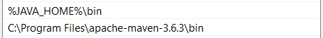

# qa-development-challenging
This is Code challenge round when I applied Aspire

## 1. Getting started
### Prerequisites
Configuring local environment

* Java in latest version. Maybe Java JDK 15 - https://www.oracle.com/java/technologies/javase-jdk15-downloads.html
* Maven - https://maven.apache.org/download.cgi?Preferred=ftp://ftp.osuosl.org/pub/apache/
* Intellij Community as IDE (can be anything else) - https://www.jetbrains.com/idea/download/#section=windows

### Installing and Validation installing
* Windows environment variables:

  
  
  Add path
  
  

* Environment variables validation:
```
#java -version
C:\Users\Dung Pham>java -version
java version "15.0.1" 2020-10-20
Java(TM) SE Runtime Environment (build 15.0.1+9-18)
Java HotSpot(TM) 64-Bit Server VM (build 15.0.1+9-18, mixed mode, sharing)
```
```
#echo %JAVA_HOME%
C:\Users\Dung Pham>echo %JAVA_HOME%
C:\Program Files\Java\jdk-15.0.1
```
```
#maven -version
Apache Maven 3.6.3 (cecedd343002696d0abb50b32b541b8a6ba2883f)
```
## 2. Running the test
There are two ways to start tests.
* First is to use TestNG files, run from `PROD All.run.xml` file by IntelliJ like this:
  
  
* Second way is to use maven, run from terminal with command:
```
mvn clean install -Denv.URL="https://feature-qa-automation.customer-frontend.staging.aspireapp.com/sg/"
```
### Tips if step fails at clicking Register button
Clean browsing data (Cached and Cookies) in current browser tab, then close all browser tabs is opened by automation test and run again.

```
I will investigate more about this issue in the future.
```
### Check report generation
Once you run successfully, open file report.html in target/jbehave/view/ folder

## 3. More details about framework
### 3.1. Folder structure
**Main Folder**

- Java folder
    - Abstract folder - contains abstract class for driver initialization. This class should extends all BasePages across all projects.
    - Project folders 
        - Pages folder – contains classes with methods for corresponding application page functionality.
    - shared folder - contains classes with common methods for pages
    - Utils – contains all Selenium helping classes, custom framework extensions etc.
  
**Test folder**
- Java folder
    - Project folder
        - Steps folder – contains JBehave steps for corresponding application page
        - JBehave runner classes – configuration for test suites.
    - common folder
        - Steps folder - contains common steps
- Resource folder
    - Project folder
        - Stories folder – contains story files with test scenarios.
        - TestNG folder – contains TestNG xml configuration and suites files.
          
### 3.2. Plugin support for developement
* JBehave - https://plugins.jetbrains.com/plugin/7268-jbehave-support
* Gherkins - https://plugins.jetbrains.com/plugin/9164-gherkin
## 4. Test cases automated
We will have many cases to test this function, I picked one testcase to automate it.

TC01: When a registered director of the company open an Aspire account by filling all mandatory fields, account is created successfully
More details testcase in `Register.story`
## 5. Points to be considered for improvement
- Improve the ease of running with multiple environments across multiple browsers.
- Improve report generation.
- Apply Docker, Jenkins in for Automation framework.
